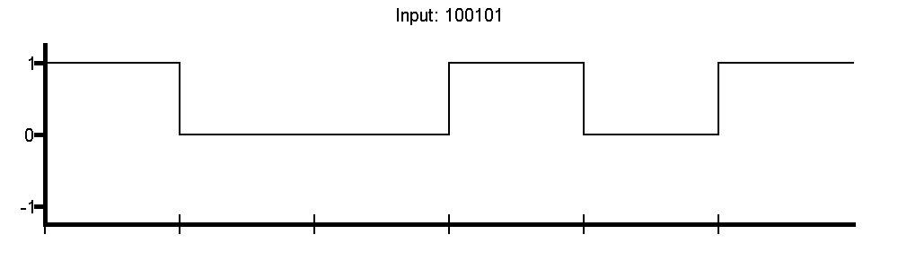
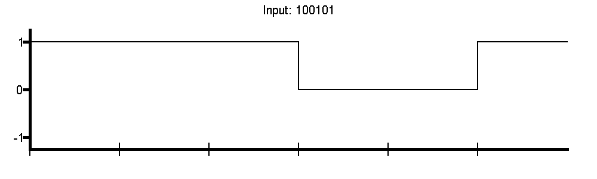
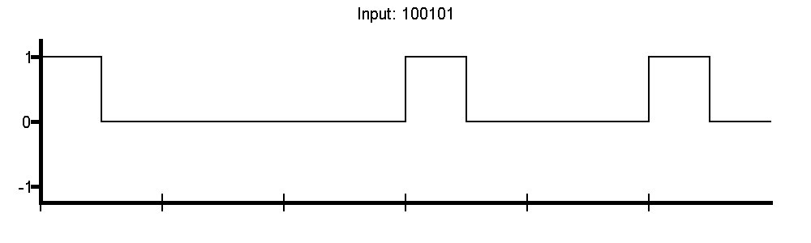
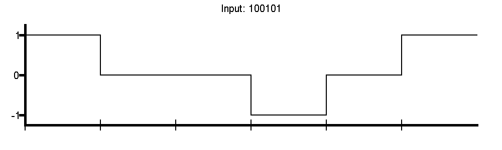
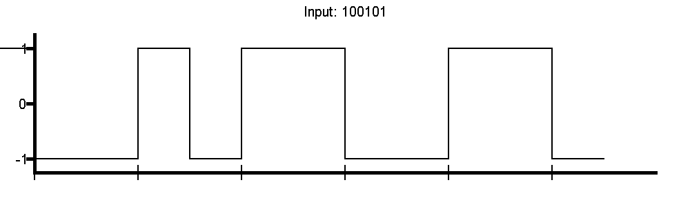

# Input to Bit-Diagram

This software was developed as a project for the DHBW-Karlsruhe.

## How to use
```
> Bitfolge eingeben:
_
```
Here you have to enter the text or bits you want to convert.
If you only enter `(0|1)+` the input is interpreted as raw bits, else it is converted to bits with the ASCII-Charset.

```
> Kodierungsverfahren eingeben (NRZ, NRZI, RZ, AMI, Manchester):
_
```
Here you have to enter the coding method to draw your input to.
Possible answers are:
- NRZ (Non-Return-To-Zero):
  
- NRZI (Non-Return-To-Zero-Inverted):
  
- RZ (Return-To-Zero):
  
- AMI (Alternating-Mark-Inversion):
  
- Manchester:
  